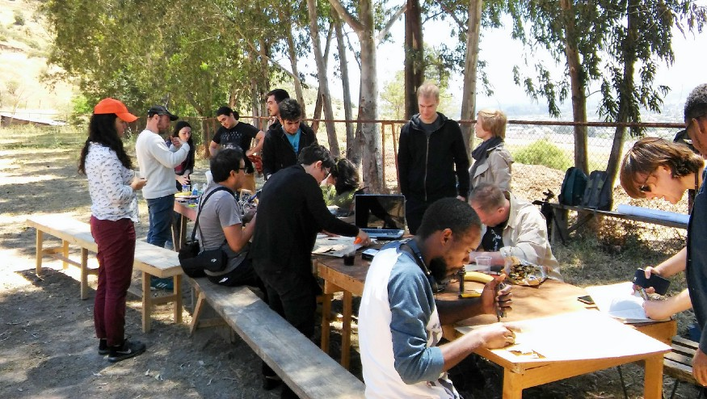
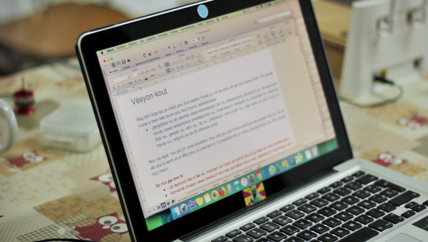
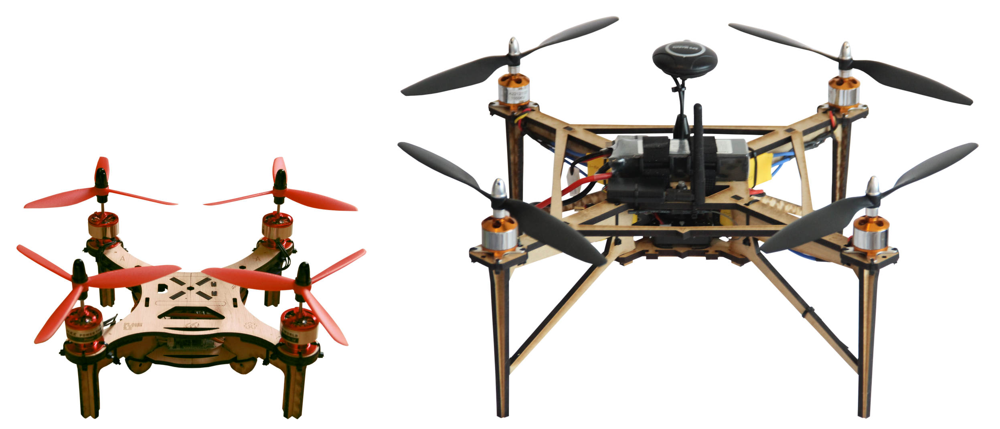

# Ciencia libre con drones

Desde 2017 hemos venido desarrollando un prototipo de kit de herramientas para hacer ciencia abierta con drones, accesible por igual para comunidades marginales, activistas o investigadores, y útil para estudios o relevamientos de datos en los que esta tecnología ya se utiliza pero está dominada por herramientas de código cerrado. Vuela se basa en hardware y software [libres](https://www.gnu.org/philosophy/free-sw.html) disponibles, los que se integran en un proceso abierto, iterativo y colaborativo. Este proyecto ha recibido fondos de Knowledge-Culture-Ecologies/NUMIES, Mozilla Science, PROCISUR y Shuttleworth Foundation.

Enfatizar de igual manera el **[quién](#qui%C3%A9nes)**, el **[por qué](#por-qu%C3%A9)**, y el **[cómo](#c%C3%B3mo)**, tanto como el **[qué](#qu%C3%A9)**, es un aspecto distintivo del proyecto.

&nbsp;

### Quiénes

Creemos que personas sin experiencia técnica previa pueden y deben trabajar codo a codo, y como iguales, con quienes poseen experiencia o entrenamiento oficial. Este tipo de colaboración tiene el poder de promover los objetivos de democratizar la ciencia y la tecnología, pero también de mejorar la relevancia, la efectividad y el impacto de éstas en la sociedad.

Los miembros de nuestra ‘tripulación’ son aficionadas, activistas de la sociedad civil, investigadores, vecinos, estudiantes, desarrolladoras, y en los talleres hemos hablado español, criollo haitiano, inglés, francés y portugués. Damos la bienvenida y alentamos la participación de todas y todos, sin importar cómo alguien se identifique o cómo la/lo perciban los demás, siempre y cuando interactúen de manera constructiva y se adhieran al [código de conducta](https://github.com/vuelaendron/vuela/blob/master/CODE_OF_CONDUCT.md#c%C3%B3digo-de-conducta-de-vuela---espa%C3%91ol).

&nbsp;

&nbsp;

### Por qué

Conseguir instrumental científico no es fácil, menos aún para grupos tales como activistas ambientales o científicas/cos de instituciones con poco presupuesto. Su participación en la ciencia se ve dificultada porque las herramientas que necesitan para levantar datos o hacer mediciones fueron diseñadas para otros contextos, son muy caras y/o no están disponibles en sus territorios. Esto, entre otras cosas, impide el accionar científico a nivel local. Y es importante puesto que la acción local es capaz de enfocarse en los problemas relevantes en un determinado contexto o territorio que la agenda científica global bien podría no llegar a priorizar o simplemente ignorar. 

Nuestro proyecto apunta al desarrollo de herramientas científicas que puedan ser útiles a grupos o comunidades que aborden problemas locales, definidos localmente, y así fomentar su participación en la ciencia. Herramientas en línea y comunidades globales están actualmente ayudando a que las tecnologías abiertas sean accesibles, tanto como para quienes están dentro de instituciones ‘de conocimiento’ tradicionales, tales como universidades e institutos de investigación, como para quienes están fuera. Pero aún existen barreras importantes y con Vuela hemos querido abordar algunas de ellas. 

Un problema que observamos es el énfasis en el desarrollo de nuevos instrumentos científicos (y en sus ‘inventores’) por sobre la adaptación de instrumentos ya existentes, lo que replica el modelo de proveedores y usuarios/clientes del hardware comercial cerrado. Las definiciones de código abierto se refieren a la capacidad de replicar, modificar, adaptar y redistribuir, pero estos pasos generalmente se dan por sentados y no son particularmente fomentados o estudiados. Queremos comprender qué es necesario para que grupos puedan replicar, modificar, y redistribuir hardware libre. Y si identificamos barreras, intentar abordarlas. Creemos que la ciencia abierta necesita un tipo diferente de ‘usuaria/o’ de herramientas científicas, que no solamente sea una usuaria sino también una colaboradora.

Una de las principales barreras a la participación en estos procesos es el idioma. El inglés es el idioma dominante entre comunidades de tecnología abierta, limitando así el acceso en América Latina, donde solo una minoría, generalmente la más privilegiada, habla este idioma. Por este motivo es que la documentación de Vuela estará en español, haitiano criollo, portugués, francés e inglés. La diversidad lingüística en la región latinoamericana es tremenda ([420 lenguas habladas](https://www.unicef.es/prensa/unicef-presenta-el-atlas-sociolinguistico-de-pueblos-indigenas-en-america-latina)), así es que estamos conscientes de que este sólo es un muy pequeño aporte. 

Otro tipo de barreras observadas son aquellas de tipo cultural. El intercambio científico tiende a darse entre actores ligados a la academia, y es el conocimiento producido dentro de ésta el que es considerado como valioso y relevante. Es inusual observar a científicos académicos trabajar a la par de, por ejemplo, grupos de la sociedad civil aquejados por un determinado problema, a pesar de que ambos grupos aborden o estudien exactamente el mismo problema. Reconsiderar quiénes pueden o deben hacer ciencia implica además replantearse qué implica hacer ciencia, dónde se puede hacer, y de qué conocimientos deben ser considerados científicos. El movimiento por la descolonización del conocimiento no es ajeno al hardware científico libre.

Link a una [lista de lecturas](https://docs.google.com/document/d/1k4ZBxsfz7rYyhF1m0xfVF_XYalut5TSyiolKbZMcTcc/edit#) (en Inglés) sobre decolonialismo.

&nbsp;

&nbsp;

### Qué

Los drones pueden ser una poderosa herramienta para la investigación en disciplinas como la agricultura y las ciencias ambientales, permitiendo la captura de imágenes aéreas con gran flexibilidad. Pero la ciencia abierta requiere instrumentos y materiales abiertos, y los drones no deberían ser una excepción. Con nuestro ‘por qué’ en mente, en lugar de desarrollar una herramienta desde cero, comenzamos este proyecto replicando, probando e identificando posibles mejoras para un dron de código abierto ya disponible llamado ‘Flone’ ([flone.cc](http://flone.cc/)), en una serie de talleres abiertos y colaborativos que comenzamos en 2017. 

En los talleres fuimos identificando varias posibles mejoras, modificaciones y adiciones al diseño original del ‘Flone’, necesarios para utilizar el dron con fines de investigación. En un uso ‘típico’ en investigación, un dron necesita poder posicionarse de manera confiable sobre el terreno estudiado y capturar imágenes de alta calidad que luego puedan procesarse para obtener una imagen o mapa de alta resolución del área estudiada. Estas mejoras fueron el objetivo de las actividades del proyecto durante 2018.

Con estas modificaciones el drone terminó siendo bastante diferente al Flone original, y lo llamamos OVLI (Objeto Volador LIbre). Además, trabajamos en identificar otras herramientas de hardware y software libre necesarias, de forma de contar con una ‘caja de herramientas’ completa.

&nbsp;

&nbsp;

### Cómo

Hemos querido desarrollar Vuela a través de un proceso iterativo y colaborativo. 

El kit ha sido construido con diversas personas: estudiantes secundarios, científicos tradicionales afiliados a instituciones académicas, periodistas, miembros de comunidades sin formación académica o tecnológica, científicas trabajando en agricultura, niños, adultos, personas con y sin experiencia fabricando o utilizando drones. Inicialmente, e idealmente, queríamos tener en el grupo a personas que ya estuvieran abordando problemas locales, para los cuales los drones podrían ser útiles. Hasta ahora, sin embargo, sólo un grupo trabajó con necesidades específicas en mente: los investigadores en agricultura.  

Entre junio de 2017 y enero de 2019 trabajamos con más de 100 personas para arribar a este prototipo en más de 30 talleres locales y presenciales, y también a través de un trabajo permanente en línea utilizando herramientas de colaboración como [GitHub](https://github.com/vuelaendron/vuela). Estamos además desarrollando documentación en diferentes idiomas (inglés, español y criollo haitiano), y en un formato que sea fácil de modificar y traducir. Entre agosto de 2018 y enero de 2019 trabajamos para mejorar el prototipo y ponerlo a prueba para investigación agrícola en 5 países de Sudamérica: Argentina, Brasil, Chile, Paraguay y Uruguay.

&nbsp;

<video src="https://github.com/vuelaendron/vuela/blob/master/docs/img/talleres_vuela.mp4?raw=true" controls="controls" style="max-width: 480px"></video>

&nbsp;

### Más información

Puedes encontrar más información sobre cómo comenzó el proyecto en estas historias:

[Medium](https://medium.com/@PazByC/cr%C3%B3nica-de-un-vuelo-anunciado-fdf3062b1b3e)

[Revista Liinc](http://revista.ibict.br/liinc/article/view/4237)

Y algunas fotos y videos acá:

[Instagram](https://www.instagram.com/sombrerohill/)

[Vimeo](https://vimeo.com/user67511666)

Podés conectarte con nosotros a través del foro: http://foro.vuela.cc/ o por email a vuelaendron@gmail.com

Y aprender cómo construirte tu propio OVLI con la [guía de construcción](https://vuelaendron.github.io/vuela/guia).

### Cómo contribuir

¡Necesitamos mucha ayuda para este proyecto! Por suerte hay muchas maneras de contribuir. Para comenzar, lee el archivo [CONTRIBUTING.md](https://github.com/vuelaendron/vuela/blob/master/CONTRIBUTING.md#c%C3%B3mo-contribuir---espa%C3%91ol) y la [lista de problemas abiertos (issues)](https://github.com/vuelaendron/vuela/issues).

### Normas de participación

Este proyecto se adhiere a un [código de conducta](https://github.com/vuelaendron/vuela/blob/master/CODE_OF_CONDUCT.md#c%C3%B3digo-de-conducta-de-vuela---espa%C3%91ol). Al participar, se espera que cumplas este código. Puedes hacer preguntas o informar conductas inadecuadas a vuelaendron@gmail.com.

