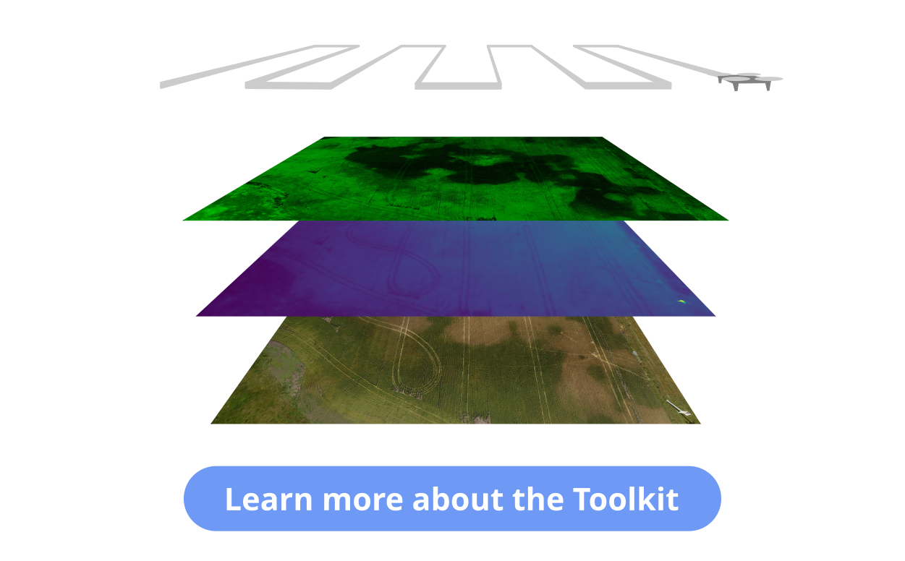

# Open science with drones

“Vuela” is a research-action project wich aims to fight the lack of access to creating scientific and technological knowledge, by exploring an alternative way of developing scientific tools.

&nbsp;
## The Toolkit

The Open Science Drone Toolkit is a set of open source hardware and software tools and also guides and protocols to enable the user to perform all the necessary tasks to obtain aerial data.

&nbsp;