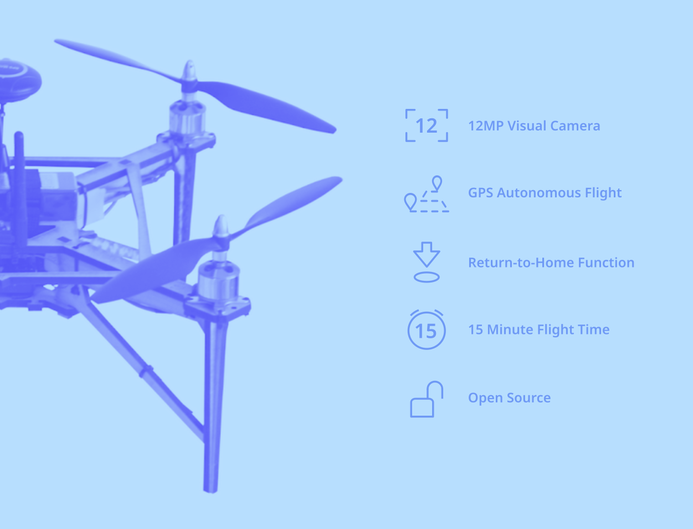

# OVLI drone

&nbsp;

&nbsp;

The OVLI drone is a quadcopter (i.e., a helicopter with four propellers), equipped with an autopilot board with accelerometer, gyroscope and GPS sensors that allow fully autonomous flight.

The OVLI has a has a payload capacity enough for a high-resolution RGB camera, multi-spectral camera, or other sensors. Operation using a camera with CHDK software allows for high-quality, high-resolution reproducible image capture suitable for reaserch purposes. With a maximum flight time of 15 minutes, the OVLI drone is capable of performing a wide range of mapping missions. Operation can be done through a manually operated radio controller, but for research purposes it is usually convenient to fly the drone autonomously using a pre-programmed flight plan. The drone follows this plan while capturing images, and information on its position, battery voltage, altitude, speed, etc. can be viewed live using its ground station software.

The OVLI is based on free and open source hardware and software, which allows the user to inspect all its components or customize it for different applications. “OVLI” is an acronym for “Objeto Volador Libre”, which means “Free Flying Object” in Spanish.

&nbsp;

## Specifications

**Airframe** |  |
--- | --- |
Weight | Without batteries or payload: 773g  - With 2200 mAh battery: 960g - With 2200 mAh battery and camera: 1100g - With 5000 mAh battery: 1125g - With 5000 mAh battery and camera: 1265g - Max total weight: 1700g
Dimensions (LxWxH) | Without propellers: 330 x 330 x 200 mm - With propellers: 470 x 470 x 200 mm
Diagonal distance | 395 mm
Max flight time | With 5000 mAh battery and camera: 15 min (11 min until 30% remaining battery)
Autopilot | Pixhawk 2.4.8 (32-bit ARM Cortex M4 core with FPU - 168 Mhz/256 KB RAM/2 MB Flash - 32-bit failsafe co-processor)
Positioning | Extended Kalman Filter algorithm based on gyroscopes, accelerometer, compass, GPS, and barometer
**Remote controller** | 
Operating frequency | 2.408 - 2.475GHz
Max transmission distance | 500 - 1500 m
RC dimensions (LxWxH) | 174 x 89 x 190 mm
RC weight | 392g
**Camera** | 
Sensor | 1/2.3-inch CMOS
Resolution | 12 megapixel
Max image size | 3000 x 4000 px
Lens | 5.0 - 20.0 mm (35mm film equivalent: 28 - 112 mm)
Maximum aperture | f/2.8 (W) - f/5.9 (T)
Shutter speed | 15 - 1/1500 sec.
Sensitivity | ISO 100 - 3200
Photo format | JPEG / DNG (RAW)
Camera dimensions (LxWxH) | 93 x 20 x 56 mm
Camera weight | 140g
**Battery** | 
Capacity | 2200 / 5000 mAh
Voltage | 11.1V
Max charging voltage | 12.6V
Battery type | LiPo
Energy | 24.4 / 55.5 Wh
Battery weight | 187 / 352g

&nbsp;

## Open Science Drone Toolkit

The OVLI drone is part of the [Open Science Drone Toolkit](toolkit), a set of open source hardware and software tools, guides and protocols to perform all the necessary tasks to obtain aerial data.

&nbsp;
