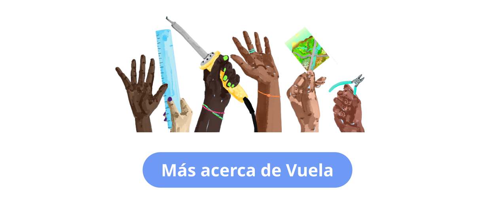
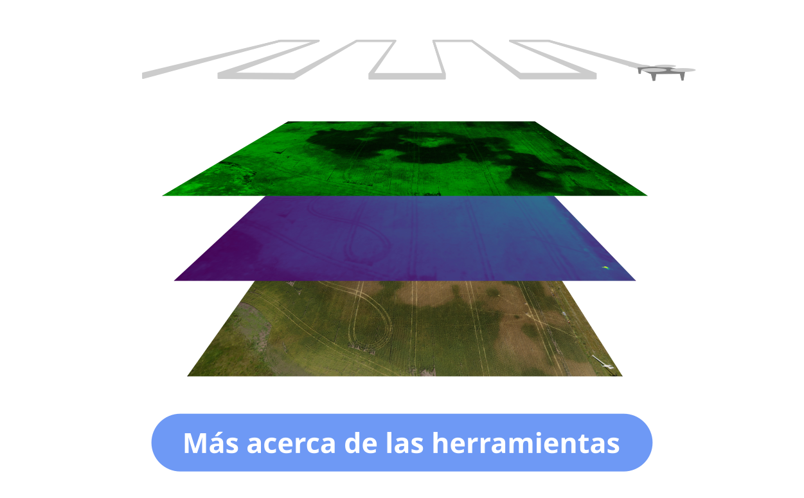

# Ciencia abierta con drones

“Vuela” es un proyecto de investigación-acción que busca combatir la falta de acceso a la creación de conocimiento científico y tecnológico, explorando una forma alternativa de desarrollar herramientas científicas.

&nbsp;
## Nuestra "caja de herramientas"

El "Open Science Drone Toolkit" es un conjunto de herramientas de hardware y software de código abierto y también guías y protocolos que permiten realizar todas las tareas necesarias para obtener datos científicos desde el aire.

&nbsp;