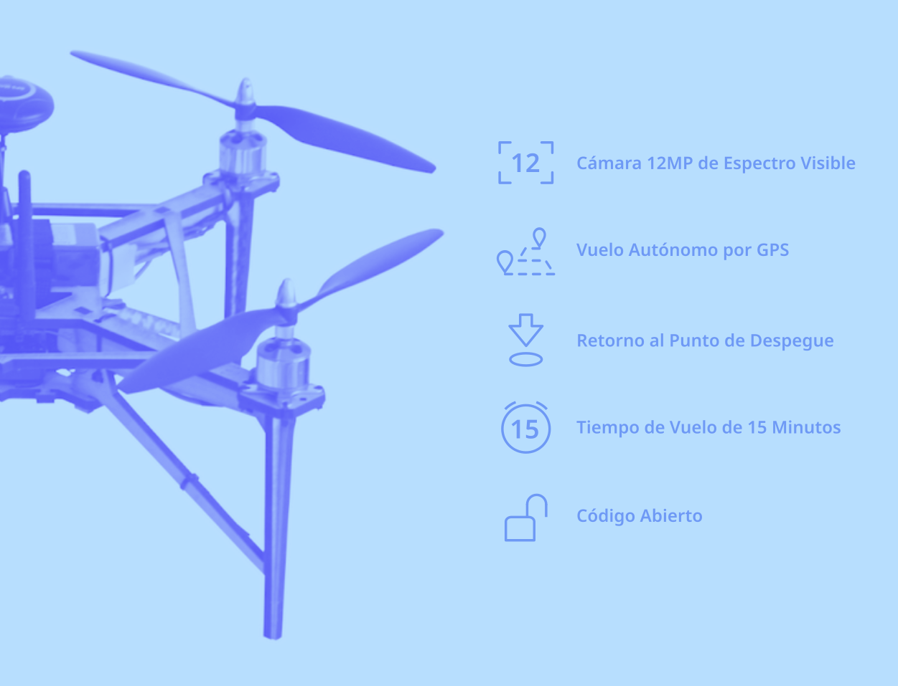

# OVLI

&nbsp;

&nbsp;

El dron OVLI es un dron multirrotor de cuatro hélices, equipado con un piloto automático con acelerómetro, giroscopio y sensores GPS que permiten un vuelo totalmente autónomo.

El OVLI tiene una capacidad de carga útil suficiente para una cámara de espectro visible (RGB) de alta resolución, una cámara multiespectral u otros sensores. El uso de una cámara con software CHDK permite la captura de imágenes reproducibles de alta calidad y alta resolución adecuadas para fines de investigación. Con un tiempo de vuelo máximo de 15 minutos, el dron OVLI es capaz de realizar una amplia gama de misiones de mapeo. El OVLI se puede operar a través de un radiocontrol manual, pero para fines de investigación, generalmente es conveniente volar el dron de forma autónoma utilizando un plan de vuelo programado previamente. El dron sigue este plan de vuelo mientras captura imágenes, y la información sobre su posición, voltaje de la batería, altitud, velocidad, etc. se puede ver en vivo desde el software de estación terrestre.

El OVLI está basado en hardware y software libre y de código abierto, lo que permite inspeccionar todos sus componentes o personalizarlo para diferentes aplicaciones. "OVLI" es un acrónimo de "Objeto Volador Libre".

&nbsp;

## Especificaciones

**Vehículo** |  |
--- | --- |
Peso | Sin baterías ni carga útil: 773g  - Con batería de 2200 mAh: 960g - Con batería de 2200 mAh y cámara: 1100g - Con batería de 5000 mAh: 1125g - Con batería de 5000 mAh y cámara: 1265g  - Peso máximo total: 1700g
Dimensiones (LxAxH) | Sin hélices: 330 x 330 x 200 mm - Con hélices: 470 x 470 x 200 mm
Distancia diagonal | 395 mm
Tiempo de vuelo máximo | Con batería de 5000 mAh y cámara: 15 min (11 min hasta 30% de batería restante)
Piloto automático | Pixhawk 2.4.8 (32-bit ARM Cortex M4 core con FPU - 168 Mhz/256 KB RAM/2 MB Flash - co-procesador 32-bit)
Posicionamiento | Algoritmo Extended Kalman Filter basado en giroscopios, acelerómetro, brújula, GPS y barómetro
**Radiocontrol** | 
Frecuencia de operación | 2.408 - 2.475GHz
Distancia máxima de transmisión | 500 - 1500 m
Dimensiones (LxAxH) | 174 x 89 x 190 mm
Peso | 392g
**Cámara** | 
Sensor | 1/2.3" CMOS
Resoluciónn | 12 megapixels
Tamaño máximo de imagen | 3000 x 4000 px
Lente | 5.0 - 20.0 mm (equivalente 35mm: 28 - 112 mm)
Apertura máxima | f/2.8 (W) - f/5.9 (T)
Velocidad de disparo | 15 - 1/1500 sec.
Sensibilidad | ISO 100 - 3200
Formato de imágen | JPEG / DNG (RAW)
Dimensiones (LxAxH) | 93 x 20 x 56 mm
Peso | 140g
**Battery** | 
Capacidad | 2200 / 5000 mAh
Voltaje | 11.1V
Voltaje máximo de carga | 12.6V
Tipo de batería | LiPo
Energía | 24.4 / 55.5 Wh
Peso | 187 / 352g

&nbsp;

## Open Science Drone Toolkit

El OVLI es parte del [Open Science Drone Toolkit](toolkit), una "caja de herramientas" compuesta por hardware y software de código abierto, guías y protocolos que permiten realizar todas las tareas necesarias para obtener datos científicos desde el aire.

&nbsp;
