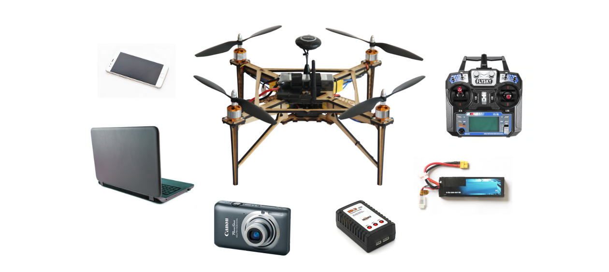
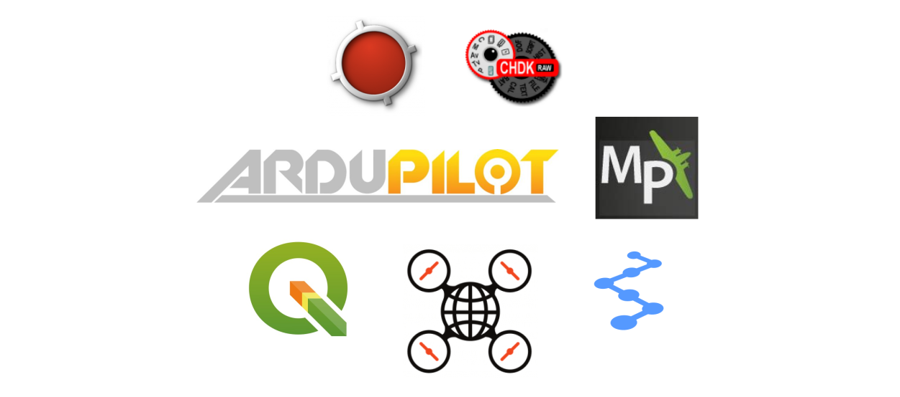

# Open Science Drone Toolkit

Drones can be a powerful tool for research in disciplines such as agriculture and environmental sciences, allowing the capture of high-resolution aerial imaging with great speed and flexibility. For a typical use, the drone needs to be able to be reliably positioned over the studied terrain and capture images that can be later processed to get a high quality image of the surveyed area and extract useful data. Although there are already many open source hardware and software tools that can be used in each of the individual steps of this process, our question was whether it was possible to perform all these steps using open source tools. We attemped to answer this question by collecting, curating, organizing and testing a comprehensive set of open source tools for aerial data capture for research purposes. The result of these actions is the Open Science Drone Toolkit (OSDT).

## What you can do with the OSDT

The OSDT is a set of open source hardware and software tools and also guides and protocols to enable the user to perform all the necessary tasks to obtain aerial data:

## How to use the toolkit

The toolkit documentation includes: a “usage guide”, with instructions for flying the drone, programming an autonomous mission, programming the camera, and image processing. 

## Build your own toolkit

An “assembly guide” is also available, that includes a step-by-step guide for building the OVLI drone, setting up and configuring the hardware components, and installing the software. Once you have all parts, it should take you just a few days to have your open hardware / open software toolkit ready.

### **Hardware**

Drone (OVLI drone)

Camera (Canon brand camera compatible with CHDK software)

Radio transmitter (generic 6-channel radio transmitter)

Batteries and charger (generic 3-cell lithium-polymer battery and balance charger)

Computer (generic PC with Windows operating system)

Smartphone (generic smartphone with Android operating system)

### **Software**

GPS recorder (GPS Logger)

Drone ground station (Mission Planner)

Camera control (CHDK)

Drone autopilot (ArduCopter)

Image processing (OpenDroneMap)

Orthomosaic processing and analysis (QGIS)

Data management (Bitácora)

### **Documentation**

Toolkit assembly guide

Toolkit usage guide

## Open source is ❤

The OVLI drone is open hardware, which means you are free to modify it. An easy way to make you own version of the OVLI is to modify the frame, which is assembled from MDF (Medium Density Fibreboard) cut with a laser cutter according to a design file, which can be edited to modify the drone structure (using the open source software Inkscape). It is also possible make your own version of the OVLI by changing the motors, propellers, etc. 

All the software in the toolkit is also open source. The Bitácora software was developed by us especially for this toolkit, and we would gladly welcome your contributions to it. You can find its source code here.

Both the “usage” and “assembly” guides are openly licensed documents (using a CC-BY-SA license, which means you can use their content as long as you cite the source and share it openly again), and also as live documents (in Google Docs) open for suggestions. 
