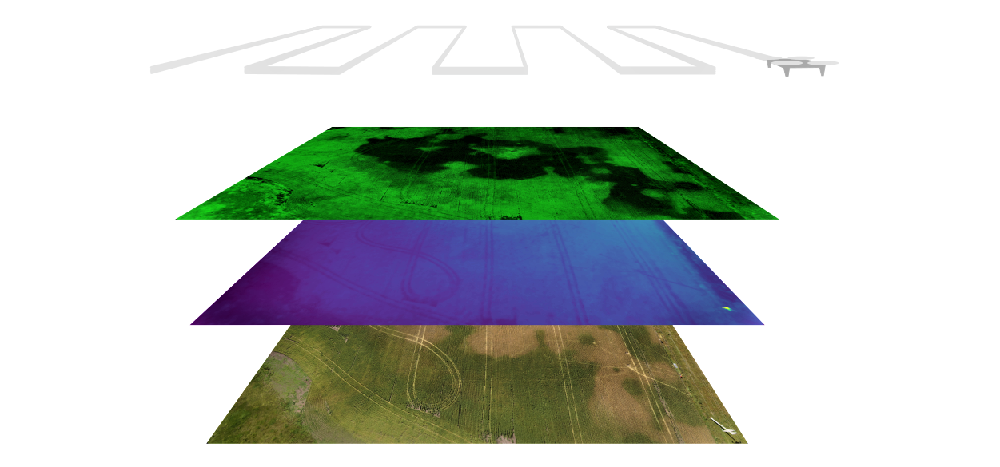
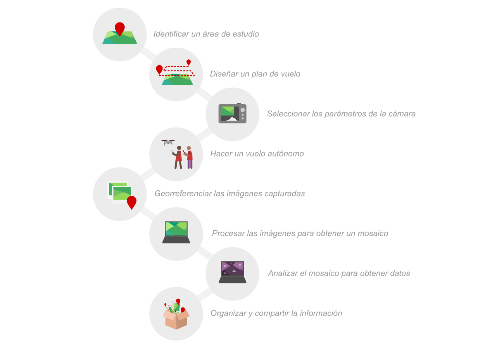

# Open Science Drone Toolkit

Los drones pueden ser una poderosa herramienta para la investigación en disciplinas como la agricultura y las ciencias ambientales, permitiendo la captura de imágenes aéreas de alta resolución con gran velocidad y flexibilidad. Para un uso típico, el dron debe poder posicionarse de manera confiable sobre el terreno estudiado y capturar imágenes, que luego se pueden procesar para obtener una imagen de alta calidad del área estudiada y extraer datos útiles. Aunque ya existen muchas herramientas de hardware y software de código abierto que se pueden utilizar en cada uno de los pasos individuales de este proceso, nos planteamos la pregunta de si era posible realizar la totalidad de estos pasos utilizando herramientas de código abierto. Intentamos responder a esta pregunta recopilando, seleccionando, organizando y evaluando un conjunto integral de herramientas de código abierto para la captura de datos aéreos con fines de investigación. El resultado de estas acciones es el "Open Science Drone Toolkit" (OSDT).

&nbsp;
## Qué se puede hacer con el OSDT

El OSDT es un conjunto de herramientas de hardware y software de código abierto y también guías y protocolos para que el usuario pueda realizar todas las tareas necesarias para obtener datos aéreos:

&nbsp;
## Cómo utilizar estas herramientas

La documentación del kit de herramientas incluye una “guía de uso”, con instrucciones para volar el dron, programar una misión autónoma, programar la cámara y procesar imágenes.

&nbsp;
## Arma tu propia caja de herramientas

También está disponible una "guía de construcción", que incluye instrucciones paso a paso para construir el dron OVLI, instalar y configurar los componentes de hardware e instalar el software. Una vez que tengas todos los componentes, solo te tomará unos días tener lista tu caja de herramientas de hardware y software abierto.

<h3 align="center">
Hardware
</h3>

Dron (<a href="https://vuela.cc/ovli">dron OVLI</a>)

 
Cámara (cámara marca Canon compatible con el software CHDK)

 
Radiocontrol (transmisor genérico de 6 canales)

 
Baterías y cargador (batería genérica de litio-polímero de 3 celdas y cargador-balanceador)

 
Computadora (PC portátil genérica con sistema operativo Windows)

 
Teléfono (teléfono móvil genérico con sistema operativo Android)

 

<h3 align="center">
Software
</h3>

Registrador de GPS (<a href="https://www.basicairdata.eu/projects/android/android-gps-logger/">GPS Logger</a>)

Estación de tierra (<a href="https://ardupilot.org/planner/">Mission Planner</a>)

Control de cámara (<a href="https://chdk.fandom.com/wiki/CHDK">CHDK</a>)

Piloto automático (<a href="https://ardupilot.org/copter/">ArduCopter</a>)

Procesamiento de imágenes (<a href="https://www.opendronemap.org/">OpenDroneMap</a>)

Procesamiento y análisis de mosaicos (<a href="https://qgis.org/">QGIS</a>)

Manejo de datos (<a href="https://vuela.cc/bitacora">Bitácora</a>)

 

<h3 align="center">
Documentación
</h3>

Guía de construcción ( <a href="https://docs.google.com/document/d/e/2PACX-1vTXeasMgMOBvqAP6wmyNhIa-ovO8ws7W8Og-I5_ktDZyjy2wyLvKLCkDlXn1ZJA4xkJHSO_x_zvbJ-8/pub">web</a> | 
                         <a href="https://docs.google.com/document/d/1_tNY7UK35flxOQ0ZQNhps3qg5j1-PpDxrRWyFFqQm7w/export?format=pdf">pdf</a> )

Guía de uso ( <a href="https://docs.google.com/document/d/e/2PACX-1vScLeK9OIsFwau_AjD0BoZ5qA3AALa-EZ8q1DCav_d9Ow6-NHXU-6HZ554YjgXLA6lWTsBkX81iXsXL/pub">web</a> | 
                         <a href="https://docs.google.com/document/d/1_JU6kWQkkMbWsNESzSVhhXOGH1_aeSgy2gr4xeK5eRg/export?format=pdf">pdf</a> )

&nbsp;
## Código abierto es ❤

El dron OVLI es hardware abierto, lo que significa que puedes modificarlo libremente. Una manera fácil de hacer tu propia versión del OVLI es modificar la estructura, que se ensambla a partir de MDF (tablero de fibra de densidad media) cortado con un cortador láser según un plano digital, que se puede editar para modificar la estructura del dron (usando el software de código abierto Inkscape). También es posible hacer tu propia versión del OVLI cambiando motores, hélices, etc.

Todo el software de la caja de herramientas también es de código abierto. El software "Bitácora" fue desarrollado por nosotros especialmente para el Toolkit, y los aportes y sugerencias son bienvenidos. Puedes encontrar su código fuente [aquí](https://github.com/gpereyrairujo/bitacora).

Tanto las guías de uso como la de construcción son documentos con licencia abierta (usando una licencia CC-BY-SA, lo que significa que se puede usar su contenido siempre que se cite la fuente y se comparta abiertamente de nuevo), y también como documentos vivos (en Google Docs) abiertos a sugerencias.
